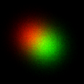
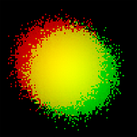

# Histplot
An efficient scatterplot alternative for large datasets

#### What's wrong with a scatterplot?
* It takes a very long time (38.8 seconds in this case) to produce a ~1Million point graph using matplotlib.pyplot
* Points overlap and hide those underneath

#### How is this different?
* Labels are assigned a RGB color
* A 2D histogram is created for each label
* RGB matricies for all labels are combined and normalized to produce a single RGB image
* Much faster (0.4 seconds)
* No obstruction
* Can be difficult to see edge cases

> More info can be found in the .ipnb file

<table align="left">
  <tr>
    <td style="text-align:center">Scatter</td>
    <td style="text-align:center">Hist</td>
    <td style="text-align:center">Hist (with gain) </td>
  </tr>
  <tr>
    <td></td>
    <td></td>
    <td></td>
  </tr>
</table>

